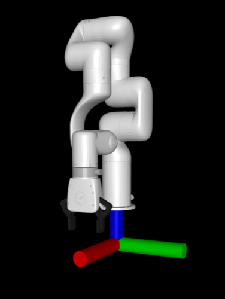
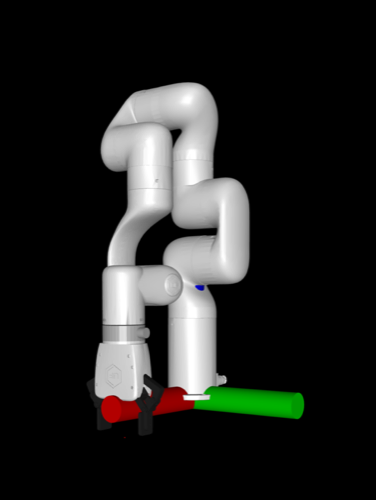
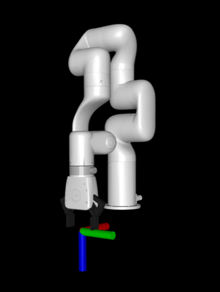
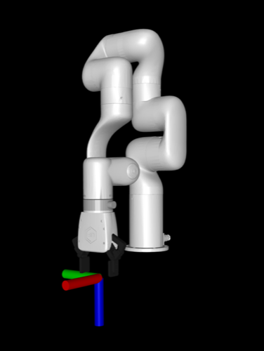

# Tutorial: Use a custom robot

This tutorial will walk you through how to use a custom robot with all the functionality provided by MolmoSpaces. Before beginning, please read through the [key concepts](../concepts.md) documentation.

In this example, we will add and use the xarm7 from [Mujoco Menagerie](https://github.com/google-deepmind/mujoco_menagerie).

## Project setup

```bash
mkdir my_project
cd my_project
uv venv -p 3.11
source .venv/bin/activate
uv pip install "git+https://github.com/allenai/molmospaces.git#egg=molmospaces[mujoco]"
```

## Setup robot assets

Download the [robot files](https://github.com/google-deepmind/mujoco_menagerie/tree/a09bd169ca2571361e09e465cd68b0c496115c3f/ufactory_xarm7) to `assets/ufactory_xarm7`.

We now need to lightly modify the robot model to adhere to the MolmoSpaces [robot conventions](https://github.com/allenai/molmospaces#robot-conventions). To begin, start by opening the robot model in the mujoco visualizer with `python -m mujoco.viewer --mjcf $(realpath assets/ufactory_xarm7/xarm7.xml)`. Note the `$(realpath ...)`, as the mujoco viewer requires absolute paths on some systems.

### Configure the base frame

In the viewer, visualize the world frame by selecting `Rendering > Frame > World`. Observe that the robot base is floating above the world frame. To fix this, modify the body `"link_base"` from `pos="0 0 .12"` to `pos="0 0 0"`.

| Before | After |
|:------:|:-----:|
|  |  |

### Configure the EE frame

In the viewer, enable site frame visualization by selecting `Rendering > Frame > Site`, and enable the TCP frame by selecting `Group enable > Site groups > Site 4`. Observe that the x axis (red) is pointing towards the robot, but the robot conventions dictate that it should point away. To fix this, add `xyaxes="-1 0 0 0 -1 0"` to the `"link_tcp"` site tag to rotate it as necessary.

| Before | After |
|:------:|:-----:|
|  |  |

### Insert cameras

Now we will add cameras to the robot model. This isn't strictly required, as MolmoSpaces supports "virtual cameras" which don't exist in the MJCF, but directly adding cameras to the MJCF can be useful for visually selecting camera poses. In this tutorial, we'll add a ZED2 exo camera and a ZED Mini wrist camera to the XArm7 MJCF.

#### Exo camera

In the `<body name="link_base">` tag, add:

```xml
<camera name="exo_camera" pos="0.05 0.3 0.4" quat="0.353553 0.146447 -0.353553 -0.853553" fovy="71.0" />
```

#### Wrist camera

In the `<body name="xarm_gripper_base_link">` tag, add:

```xml
<camera name="wrist_camera" pos="-0.07 0 0" quat="0.061628 0.704416 -0.704416 -0.061628" fovy="52.0" />
```

## Implement move groups and robot view

MolmoSpaces uses move groups and robot views to abstract away robot-specific details and provide a common interface for working with many different types of robots. We will now implement these abstractions for the xarm7 in `xarm7_view.py`.

### Base group

The xarm7 is a static manipulator, so we will implement the base as a mocap base. These are unactuated, but can be teleoported in order to move the robot in the scene during task sampling. Rather than putting this base in the robot model, we will create it at runtime when inserting the robot, which enables runtime configuration and randomization, and even disabling the base, if for example you want to mount the arm onto a pre-existing table in the scene. This follows the same pattern as the Franka FR3 implemented in MolmoSpaces.

The base group implementation is simple, as all the functionality is already implemented in `MocapRobotBaseGroup`, which provides base functionality for mocap base groups, i.e. unactuated teleportable bases.

```python
class XArm7BaseGroup(MocapRobotBaseGroup):
    def __init__(self, mj_data: MjData, namespace: str = "") -> None:
        self._namespace = namespace
        body_id: int = mj_data.model.body(f"{namespace}base").id
        super().__init__(mj_data, body_id)
```

### Arm group

Arms tend to be fairly similar, so we can copy much of the arm move group implementation from the [Franka FR3 implementation](https://github.com/allenai/molmospaces/blob/main/molmo_spaces/robots/robot_views/franka_fr3_view.py#L30-L64). As explained in the key concepts, each move group has a root frame and a leaf frame. For the arm, the root frame is the arm root body (which is NOT the mocap base) and the leaf frame is the gripper frame.

Note the references to the xml tags as necessary, e.g. `joint1,...,joint7`, `link_base` being the arm root body, and `link_tcp` as the arm's leaf site. The `namespace` is used to ensure uniqueness of robot assets, and allows for multiple robots in the same scene. In MolmoSpaces we use `robot_0/` as the default namespace.

Note that the move group inherits from `MJCFFrameMixin` and `SimplyActuatedMoveGroup`. See the key concepts for further explanation, but briefly, these provide base functionality for standard arms, and allow for interoperability with many robot-agnostic components in MolmoSpaces. More complicated robots (linkages, passive joints, ball joints) will require custom implementation, and those should inherit from the base `MoveGroup` class as necessary.


```python
class XArm7ArmGroup(MJCFFrameMixin, SimplyActuatedMoveGroup):
    def __init__(
        self,
        mj_data: MjData,
        base_group: XArm7BaseGroup,
        namespace: str = "",
    ) -> None:
        model = mj_data.model
        self._namespace = namespace
        joint_ids = [model.joint(f"{namespace}joint{i + 1}").id for i in range(7)]
        act_ids = [model.actuator(f"{namespace}act{i + 1}").id for i in range(7)]
        self._arm_root_id = model.body(f"{namespace}link_base").id
        self._ee_site_id = model.site(f"{namespace}link_tcp").id
        super().__init__(mj_data, joint_ids, act_ids, self._arm_root_id, base_group)

    @property
    def leaf_frame_id(self) -> int:
        return self._ee_site_id

    @property
    def leaf_frame_type(self):
        return "site"

    @property
    def root_frame_to_world(self) -> np.ndarray:
        return body_pose(self.mj_data, self._arm_root_id)
```

### Gripper group

Gripper move groups should inherit from `GripperGroup`, which provides an interface for working with grasping.
Note that gripper groups usually don't inherit from `SimplyActuatedMoveGroup`, as they contain more complicated kinematics
such as linkages. Also, observe that grippers often use the TCP as both the root and leaf frame of the move group.

In this implementation, note the references to elements in the model XML. Additionally, the XArm7 gripper
specifically has 0 and 255 as the actuation bounds, which mean "open" and "closed" respectively. Different
gripper models may have different conventions, and should be handled accordingly.

Furthermore, note the `_finger_1_geom_id` and `_finger_2_geom_id` fields.
We use these to calculate the inter finger distance, which is used to estimate if the gripper
is open or closed. The min and max inter finger distance is calculated in `inter_finger_dist_range`, which
we'll leave unimplemented for the moment, as we'll measure this empirically from the robot model.

```python
class XArm7GripperGroup(MJCFFrameMixin, GripperGroup):
    def __init__(
        self, mj_data: MjData, base_group: XArm7BaseGroup, namespace: str = ""
    ) -> None:
        model = mj_data.model
        self._namespace = namespace
        joint_ids = [
            model.joint(f"{namespace}left_driver_joint").id,
            model.joint(f"{namespace}right_driver_joint").id,
        ]
        act_ids = [model.actuator(f"{namespace}gripper").id]
        root_body_id = model.body(f"{namespace}xarm_gripper_base_link").id
        super().__init__(mj_data, joint_ids, act_ids, root_body_id, base_group)
        self._ee_site_id = model.site(f"{namespace}link_tcp").id
        self._finger_1_geom_id = model.geom(f"{namespace}left_finger_pad_2").id
        self._finger_2_geom_id = model.geom(f"{namespace}right_finger_pad_2").id

    @property
    def leaf_frame_id(self) -> int:
        return self._ee_site_id

    @property
    def leaf_frame_type(self):
        return "site"

    def set_gripper_ctrl_open(self, open: bool) -> None:
        self.ctrl = [0 if open else 255]

    @property
    def inter_finger_dist_range(self) -> tuple[float, float]:
        raise NotImplementedError("We'll come back to this")

    @property
    def inter_finger_dist(self) -> float:
        dist = mujoco.mj_geomDistance(
            self.mj_model, self.mj_data, self._finger_1_geom_id, self._finger_2_geom_id, 0.1, None
        )
        return max(0.0, dist)

    @property
    def root_frame_to_world(self) -> np.ndarray:
        return self.leaf_frame_to_world
```

### Robot view

Now that we've implemented all our move groups, let's put it all together in a robot view.
The implementation is fairly straightforward, as most of the functionality is provided
by the base `RobotView` class.

```python
class XArm7RobotView(RobotView):
    def __init__(self, mj_data: MjData, namespace: str = "") -> None:
        self._namespace = namespace
        base = XArm7BaseGroup(mj_data, namespace)
        move_groups = {
            "base": base,
            "arm": XArm7ArmGroup(mj_data, base, namespace),
            "gripper": XArm7GripperGroup(mj_data, base, namespace),
        }
        super().__init__(mj_data, move_groups)

    @property
    def name(self) -> str:
        return "xarm7"

    @property
    def base(self) -> XArm7BaseGroup:
        return self._move_groups["base"]
```

## Implement robot config and robot class

### Robot config

The robot config specified robot-specific parameters, including where the robot xml is.
Importantly, note the `robot_dir` field, which points to the directory containing the robot assets.
If unspecified, MolmoSpaces will attempt to load the robot from one of the prepackaged MolmoSpaces robots.
Additionally, note the `init_qpos` field, which should be configured to set each move group's joints
to a proper initial configuration. Due to the setup of the xarm's mjcf, zeros work fine.

This implementation should be in `xarm7_config.py`.


```python
class XArm7RobotConfig(BaseRobotConfig):
    robot_cls: type[XArm7Robot] | None = XArm7Robot
    robot_factory: Callable[[MjData, Any], Robot] | None = XArm7Robot
    robot_namespace: str = "robot_0/"
    robot_view_factory: RobotViewFactory | None = XArm7RobotView
    name: str = "xarm7"
    robot_xml_path: Path = Path("xarm7.xml")
    robot_dir: Path = Path("assets/ufactory_xarm7").resolve()
    base_size: list[float] | None = [0.25, 0.25, 0.25]
    init_qpos: dict[str, list[float]] = {
        "base": [],
        "arm": [0.0] * 7,
        "gripper": [0.0, 0.0],
    }
    init_qpos_noise_range: dict[str, list[float]] | None = None
    command_mode: dict[str, str | None] = {
        "arm": "joint_position",
        "gripper": "joint_position",
    }
    gravcomp: bool = True

    def model_post_init(self, __context):
        super().model_post_init(__context)
        if "gripper" in self.command_mode:
            assert self.command_mode["gripper"] == "joint_position"
        if "arm" in self.command_mode:
            assert self.command_mode["arm"] in ["joint_position", "joint_rel_position"]
```

### Robot class

The robot class represents the whole robot - it contains the robot view and move groups, and presents an interface for controlling and interfacing with the robot.

Note the `add_robot_to_scene()` class method, which uses mujoco spec editing to insert the robot into the scene. This is where the runtime mocap base insertion happens.

This implementation should be in `xarm7.py`.

```python
class XArm7Robot(Robot):
    def __init__(
        self,
        mj_data: MjData,
        config: "MlSpacesExpConfig",
    ) -> None:
        super().__init__(mj_data, config)
        self._robot_view = config.robot_config.robot_view_factory(
            mj_data, config.robot_config.robot_namespace
        )
        self._kinematics = MlSpacesKinematics(config.robot_config)
        self._parallel_kinematics = SimpleWarpKinematics(config.robot_config)

        arm_controller_cls = (
            JointPosController
            if config.robot_config.command_mode == {}
            or config.robot_config.command_mode["arm"] == "joint_position"
            else JointRelPosController
        )
        self._controllers = {
            "arm": arm_controller_cls(self._robot_view.get_move_group("arm")),
            "gripper": JointPosController(self._robot_view.get_move_group("gripper")),
        }

    @property
    def namespace(self):
        return self.exp_config.robot_config.robot_namespace

    @property
    def robot_view(self):
        return self._robot_view

    @property
    def kinematics(self):
        return self._kinematics

    @property
    def parallel_kinematics(self):
        return self._parallel_kinematics

    @property
    def controllers(self) -> dict[str, Controller]:
        return self._controllers

    def get_arm_move_group_ids(self) -> list[str]:
        return ["arm"]

    def reset(self) -> None:
        for mg_id, default_pos in self.exp_config.robot_config.init_qpos.items():
            if mg_id in self._robot_view.move_group_ids():
                self._robot_view.get_move_group(mg_id).joint_pos = default_pos

    @staticmethod
    def robot_model_root_name() -> str:
        return "link_base"

    @classmethod
    def add_robot_to_scene(
        cls,
        robot_config: "XArm7RobotConfig",
        spec: MjSpec,
        prefix: str,
        pos: list[float],
        quat: list[float],
        randomize_textures: bool = False,
        strip_meshes: bool = False,
    ) -> None:
        robot_config = cast("XArm7RobotConfig", robot_config)
        add_base = robot_config.base_size is not None
        pos = pos + [0.0] if len(pos) == 2 else pos

        robot_body = spec.worldbody.add_body(
            name=f"{prefix}base",
            pos=pos,
            quat=quat,
            mocap=True,
        )
        if add_base:
            base_height = robot_config.base_size[2]

            robot_body.add_geom(
                type=mjtGeom.mjGEOM_BOX,
                size=[x / 2 for x in robot_config.base_size],
                pos=[0, 0, base_height / 2],
                rgba=[0.4, 0.4, 0.4, 1.0],
                group=0,  # Visual group
            )
            attach_frame = robot_body.add_frame(pos=[0, 0, base_height])
        else:
            attach_frame = robot_body.add_frame()

        robot_spec = cls._load_robot_spec(robot_config, strip_meshes=strip_meshes)
        robot_root_name = cls.robot_model_root_name()
        robot_root = robot_spec.body(robot_root_name)
        if robot_root is None:
            raise ValueError(f"Robot {robot_root_name=} not found in {robot_spec}")
        attach_frame.attach_body(robot_root, prefix, "")
```

## Go back and tweak gripper move group

We said we'd come back to the gripper's inter finger distance range, and now that we have the robot infrastructure set up we can empirically measure it!

```bash
python -m molmo_spaces.robots.find_gripper_finger_range xarm7_config XArm7RobotConfig
```

Which outputs:
```
Gripper finger ranges:
    Gripper 'gripper': 0.004 - 0.089
```

Now we can go back and change `inter_finger_dist_range` to return `0.004, 0.089`.

## Integration test

We've finished integrating the robot model! Let's do some quick integration tests to make sure everything works.

```bash
python -m molmo_spaces.kinematics.test_robot_ik XArm7RobotConfig --config_module xarm7_config
```

You should see the xarm7 moving back and forth between two end-effector poses. To test the parallel IK integration, run it again with the `--parallel` flag.

## Camera system

The robot model is now integrated with MolmoSpaces, but in order to run data generation we also need to configure the cameras that we added to the MCJF earlier.

In `xarm7_datagen.py`, add the following camera system config. Note the slightly nonstandard image resolution, which is the result of a [known issue](https://github.com/allenai/molmospaces/issues/84).

```python
class XArm7CameraSystem(CameraSystemConfig):
    img_resolution: tuple[int, int] = (624, 352)

    cameras: list[AllCameraTypes] = [
        MjcfCameraConfig(
            name="wrist_camera_zed_mini",
            mjcf_name="wrist_camera",
            robot_namespace="robot_0/",
        ),
        MjcfCameraConfig(
            name="exo_camera_zed_2",
            mjcf_name="exo_camera",
            robot_namespace="robot_0/",
        ),
    ]
```

## Datagen config

Finally, we need to set up our experiment config to run data generation! In this example, we'll generate data for the picking task. Add the following experiment config to `xarm7_datagen.py`. Note how we register the experiment config, which is required for the `molmo_spaces.data_generation.main` entrypoint. Furthermore, observe how we configure the robot pose sampling constraints to account for the working envelope of the XArm7.

```python
@register_config("XArm7PickDataGenConfig")
class XArm7PickDataGenConfig(PickBaseConfig):
    robot_config: XArm7RobotConfig = XArm7RobotConfig()
    camera_config: XArm7CameraSystem = XArm7CameraSystem()
    output_dir: Path = Path("experiment_output") / "datagen" / "xarm7_pick_v1"
    num_workers: int = 4  # number of rollout processes
    task_sampler_config: PickTaskSamplerConfig = PickTaskSamplerConfig(
        task_sampler_class=PickTaskSampler,
        dataset_name="procthor-10k",  # Which house dataset to use
        house_inds=list(range(4)),  # Run in first 4 houses
        samples_per_house=2,  # Number of episodes to sample per house
        # The XArm7 has a max reach of 0.7m, constrain to 0.6m for safety
        base_pose_sampling_radius_range=(0.15, 0.6),
        # Offset between bottom of robot base and pickup object (see the base size in the robot config)
        robot_object_z_offset=-0.25,
        # Randomize the robot z around the offset
        robot_object_z_offset_random_min=-0.2,
        robot_object_z_offset_random_max=0.2,
    )

    @property
    def tag(self) -> str:
        return "xarm7_pick_datagen"
```

## Generate data!

Congratulations, your robot is now ready for data generation! The task sampler config can be adjusted to change the amount of generated data, or other datagen parameters.

```bash
python -m molmo_spaces.data_generation.main xarm7_datagen:XArm7PickDataGenConfig
```

Results in data such as [this](./add_robot/datagen.mp4).

## Full example code

Full example code (without modified robot models) is provided [here](https://github.com/allenai/molmospaces/blob/main/examples/add_robot/).

## Additional resources

This tutorial covers adding a new single static manipulator, but more complicated robots might require additional machinery. For further examples, see:
 - Manipulator on a mobile base: [Mobile Franka](https://github.com/allenai/molmospaces/blob/main/molmo_spaces/robots/mobile_franka.py)
 - Floating gripper: [Floating RUM](https://github.com/allenai/molmospaces/blob/main/molmo_spaces/robots/floating_rum.py).

To make a custom bimanual robot from two single-arm manipulators, for example, consider reusing the robot view implementations in a new robot implementation, and just inserting the robot twice during model insertion. Namespacing (e.g. `left/` and `right/`) can be used to prevent model name collisions.
